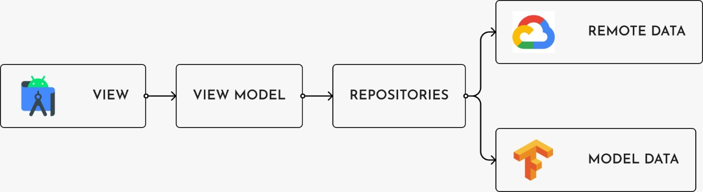

# Discoffery
Repository for bangkit capstone project
<div id="top"></div>

<p align="center">
<br> 
</p>


<!-- PROJECT LOGO -->
<br />
<div align="center">
  <a href="https://github.com/othneildrew/Best-README-Template">
  
  </a>

  <h1 align="center">Android Developer Learning Path</h1>

  
</div>

<!-- GETTING STARTED -->
## Getting Started
### Adding dependecies

1. These are our dependency that we use
  ```sh
  	dependencies {
	      implementation 'androidx.legacy:legacy-support-v4:1.0.0'
    implementation 'com.google.firebase:firebase-auth-ktx:21.0.5'
    implementation 'org.tensorflow:tensorflow-lite-support:0.1.0'
    implementation 'org.tensorflow:tensorflow-lite-metadata:0.1.0'
    implementation 'androidx.navigation:navigation-fragment-ktx:2.4.2'
    implementation 'androidx.navigation:navigation-ui-ktx:2.4.2'
    implementation 'com.google.firebase:firebase-auth:19.2.0'

    def camerax_version = "1.1.0-beta02"

    implementation 'androidx.core:core-ktx:1.8.0'
    implementation 'androidx.appcompat:appcompat:1.4.2'
    implementation 'com.google.android.material:material:1.6.1'
    implementation 'androidx.constraintlayout:constraintlayout:2.1.4'
    testImplementation 'junit:junit:4.13.2'
    androidTestImplementation 'androidx.test.ext:junit:1.1.3'
    androidTestImplementation 'androidx.test.espresso:espresso-core:3.4.0'

    implementation "androidx.viewpager2:viewpager2:1.0.0"

    implementation "androidx.camera:camera-camera2:${camerax_version}"
    implementation "androidx.camera:camera-lifecycle:${camerax_version}"
    implementation "androidx.camera:camera-view:${camerax_version}"

    implementation 'com.google.android.gms:play-services-maps:18.0.2'
    implementation 'com.google.android.gms:play-services-location:19.0.1'

    implementation 'com.intuit.sdp:sdp-android:1.0.6'
    implementation 'com.intuit.ssp:ssp-android:1.0.6'
    implementation 'com.tbuonomo:dotsindicator:4.3'

    implementation 'com.github.PhilJay:MPAndroidChart:v3.1.0'
    implementation 'com.google.android.gms:play-services-auth:20.2.0'
    

    implementation 'com.squareup.retrofit2:retrofit:2.9.0'
    implementation "com.squareup.retrofit2:converter-gson:2.9.0"

    implementation "androidx.lifecycle:lifecycle-viewmodel-ktx:2.4.1"
    implementation "androidx.lifecycle:lifecycle-livedata-ktx:2.4.1"

    implementation "com.squareup.okhttp3:logging-interceptor:4.9.1"

    implementation 'com.github.bumptech.glide:glide:4.13.1'
		 		 
	}
  ```
  
  2. Android Architecture
     
     
  3. How to use 
     - Clone this repository
     - Checkout 'MD' branch
     - Open with Android Studio or any IDE for android development
     - Wait for the gradle to be sync
     - Launch the app
